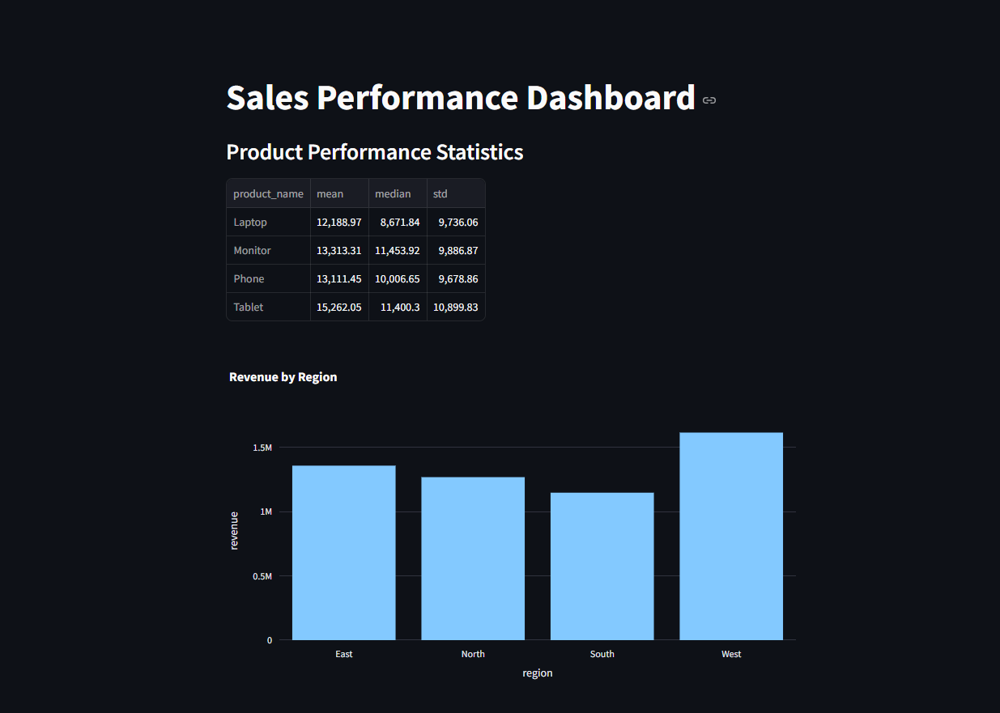

# Sales Performance Dashboard

A data analytics dashboard that provides real-time insights into sales performance metrics using Python, SQL, and interactive visualizations.



## Features

- Interactive sales performance dashboard
- Statistical analysis of product performance
- Regional revenue visualization
- SQLite database integration
- Real-time data processing

## Tech Stack

- **Python** - Primary programming language
- **SQLite** - Database management
- **Streamlit** - Web interface
- **Plotly** - Data visualization
- **Pandas** - Data manipulation
- **SciPy** - Statistical analysis

## Installation

1. Clone the repository
2. Install dependencies:  
```bash  
pip install -r requirements.txt  
```

3. Create and populate the database:  
```bash  
python src/create_sample_data.py  
```

4. Run the dashboard:  
```bash  
streamlit run src/dashboard.py  
```

## Usage

The dashboard will automatically open in your default web browser at `http://localhost:8501`. You can view:
- Product performance statistics
- Revenue by region visualization
- Key sales metrics

## Future Enhancements

- Date range filtering
- Additional visualizations
- Product-specific analysis
- Predictive analytics
- Export functionality

## Contributing

Feel free to fork this project and submit pull requests for any improvements.

## License

This project is licensed under the MIT License - see the LICENSE file for details.